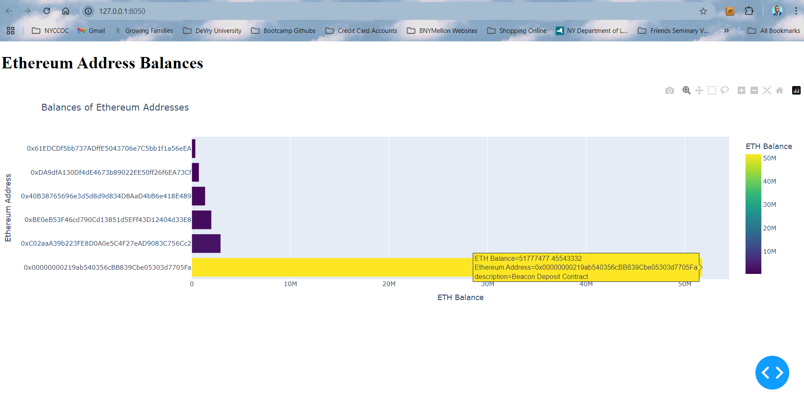

# Crypto-User-Behavior-Analytics-Dashboard
This project analyzes on-chain user behavior across various Ethereum addresses using data from the Etherscan API. It retrieves the balances of specified addresses, stores the data in a PostgreSQL database, and provides a visual representation of the balances through a Dash web application.

## Project Structure
- `data/`: Directory for storing raw and processed data.
- `scripts/`: Contains Python scripts for data extraction, transformation, and database operations.
- `dashboard/`: Contains the Dash app for data visualization.
- `docs/`: Documentation related to the project.
- `eth_addresses.json`: JSON file containing Ethereum addresses for analysis.

## Setup Instructions
1. **Clone this repository**.
2. **Create a virtual environment** and activate it:
   ```bash
   python -m venv venv
   source venv/bin/activate  # On Windows use `venv\Scriptsctivate`
   ```
3. **Install dependencies**:
   ```bash
   pip install -r requirements.txt
   ```
4. **Set up environment variables** in a `.env` file:
   ```
   ETHERSCAN_API_KEY=your_actual_api_key
   POSTGRES_USER=your_postgres_username
   POSTGRES_PASSWORD=your_postgres_password
   ```
5. **Run the data extraction script** to fetch balances from Etherscan:
   ```bash
   python scripts/extract_data.py
   ```
6. **Run the transformation script** to process the data:
   ```bash
   python scripts/transform_data.py
   ```
7. **Start the Dash application**:
   ```bash
   python dashboard/app.py
   ```
   Access the dashboard at `http://127.0.0.1:8050/`.

## Visualizations
The dashboard visualizes the balances of Ethereum addresses using:
- Bar charts (horizontal for better readability)


## Note
Replace placeholder values (e.g., API key, database credentials) with your actual values before running the scripts.
